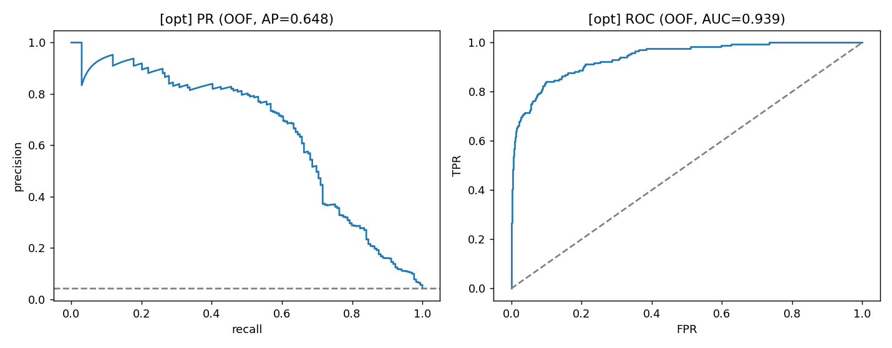
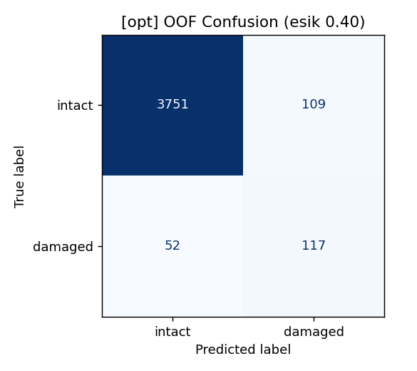
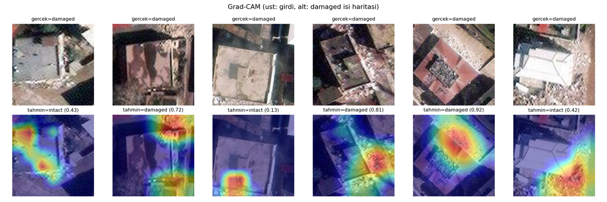

# Building Damage Assessment

[](https://github.com/memreunlucan15/building-damage-assessment/actions/workflows/tests.yml)

A computer engineering capstone project for **detecting earthquake-damaged buildings from post-event satellite imagery**, using PyTorch and a local Flask application.

## Project goal

The project investigates whether optical RGB and synthetic aperture radar (SAR) imagery can identify damaged buildings when labelled damage examples are scarce. It combines model comparison, recall-oriented training, and an interface for inspecting predictions.

The task is binary classification of building-centred image crops: `intact` or `damaged`. The application adds batch uploads, adjustable thresholds, Grad-CAM overlays, CSV export, and experimental analysis of larger scenes.

## Approach

- **Models:** ResNet18/34 backbones, with separate branches and concatenated features for optical–SAR fusion.
- **Training:** transfer learning, balanced sampling, focal loss, shared spatial augmentation across modalities, and two-stage fine-tuning.
- **Evaluation:** stratified five-fold cross-validation. Each training fold reserves 15% for early stopping and threshold selection. Thresholds favour recall subject to validation precision ≥ 0.50, falling back to the best F2 score.
- **Inference:** the application averages five optical ResNet18 models with horizontal/vertical flip augmentation. Larger scenes use overlapping windows or an optional pretrained YOLO building detector.

Implementation: [training engine](engine.py), [multimodal model](model_mm.py), [evaluation pipeline](cross_validate_mm.py), and [inference](inference.py).

## Results and outcome

Recorded experiment results below are **means across five folds**. Precision, recall, and F1 refer to the `damaged` class; AP is average precision, labelled `pr_auc` in the code.

| Configuration | Recall | Precision | F1 | ROC-AUC | AP |
| --- | ---: | ---: | ---: | ---: | ---: |
| **Optical · ResNet18** | 0.686 | 0.565 | **0.616** | 0.946 | 0.673 |
| SAR · SAR-HUB | 0.321 | 0.286 | 0.202 | 0.802 | 0.240 |
| Optical + SAR · ImageNet | 0.681 | 0.549 | 0.603 | 0.944 | 0.667 |
| Optical + SAR · SAR-HUB | **0.729** | 0.499 | 0.590 | 0.944 | **0.687** |
| Optical + footprint | 0.639 | 0.568 | 0.599 | 0.944 | 0.685 |
| Optical · ResNet34 | 0.663 | **0.573** | 0.608 | **0.947** | 0.682 |

**The goal is partially achieved.** The project provides a classification and inspection pipeline, but reliable detection remains incomplete: the optical model misses roughly one-third of damaged buildings at the evaluated thresholds. SAR-HUB fusion increases recall to 72.9%, while precision drops to 49.9%. Optical ResNet18 is used in the application for its stronger F1 balance.

The application ensemble still needs evaluation on an independent holdout; the table measures individual fold models.

<details>
<summary>Evaluation plots and prediction examples</summary>





These plots use pooled out-of-fold predictions, so their metrics differ from fold averages. The confusion-matrix threshold was selected on those pooled labels; this is a diagnostic view, not an independent threshold evaluation.



The Grad-CAM example comes from the earlier single-split workflow. Top: input crops; bottom: overlays for the damaged class. Original labels use `gercek` for ground truth and `tahmin` for prediction. Heatmaps help inspect model behaviour but do not establish prediction correctness.

</details>

## Data

Experiments use [QuickQuakeBuildings](https://github.com/ya0-sun/PostEQ-SARopt-BuildingDamage), based on imagery from the 2023 Turkey–Syria earthquakes. The reported working dataset contains **4,029 buildings: 169 damaged and 3,860 intact**.

Download instructions are available in the dataset repository. Place the extracted class folders under:

```text
earthquake_building_dataset/
├── damaged/
│   ├── <id>_opt.mat       # RGB, key x3
│   ├── <id>_SAR.mat       # SAR, key x1
│   ├── <id>_optftp.mat    # optical footprint, key x4
│   └── <id>_SARftp.mat    # SAR footprint, key x2
└── intact/
    └── ...
```

Files are MATLAB v7.3/HDF5. Optical files are required for indexing; other files are needed for the corresponding experiments. This project generates its own stratified folds rather than using the upstream fold lists.

## Getting started

Use Python 3.12, matching CI, and an activated virtual environment. CUDA is used when available; CPU execution is supported.

```bash
git clone https://github.com/memreunlucan15/building-damage-assessment.git
cd building-damage-assessment
python -m pip install -r requirements.txt
```

**The dataset and trained checkpoints are not bundled.** After preparing the data, train the default optical configuration:

```bash
python cross_validate_mm.py --modalities opt --tag opt --folds 5 --epochs 25
```

This creates `outputs/cv_opt/fold1.pt` through `fold5.pt`, metrics, and plots. Keep `cv_results.json` alongside the checkpoints for the selected inference threshold; otherwise it defaults to 0.50. Model settings in [config.py](config.py) must match the checkpoints.

Launch the application:

```bash
python app.py
```

Open [http://127.0.0.1:5000](http://127.0.0.1:5000). The interface is currently in Turkish. Upload PNG, JPG, TIF, or optical MAT crops; use scene analysis for larger images.

For CLI prediction:

```bash
python predict.py path/to/crops/ --csv predictions.csv
```

The CLI accepts `*_opt.mat` files or folders containing them.

<details>
<summary>Optional SAR experiments and scene tools</summary>

For SAR-HUB experiments, download the upstream weights:

```bash
python -m pip install gdown
gdown --folder "https://drive.google.com/drive/folders/1D8zA4unMK6ROvUKNMawbL3V3GbdnDK0Y" -O weights/sarhub
python cross_validate_mm.py --modalities SAR --tag SAR --folds 5 --epochs 25
python cross_validate_mm.py --modalities opt,SAR --tag opt_SAR --folds 5 --epochs 25
```

The expected weight file is `weights/sarhub/ResNet18_TSX.pth`. SAR pretraining, backbone, and footprint options are configured in [config.py](config.py).

Grid scene analysis needs no additional detector. To enable YOLO building detection:

```bash
python -m pip install ultralytics huggingface_hub
python detector.py --download
```

To generate and inspect a synthetic scene after training:

```bash
python make_mosaic.py --n-buildings 40 --out outputs/mosaic/demo.png
python evaluate_scene.py outputs/mosaic/demo.png outputs/mosaic/demo_truth.csv --mode grid
```

These mosaics reuse dataset crops and are for pipeline checks, not independent generalization measurements.

</details>

## Limitations and next steps

- **Generalization:** only 169 positive examples are available. Random building-level folds do not establish performance on unseen regions, sensors, or earthquakes. Geographic/event holdouts and more damage examples are priorities.
- **Scope:** classification uses post-event crops and two labels. Damage severity and before/after change detection are not implemented. Grid windows are candidate regions, not building footprints.
- **Scene validation:** the larger-scene tools lack a published real-scene benchmark. Detector misses and the fast candidate-filtering stage can also miss damage.
- **Reproducibility:** trained checkpoints, raw experiment outputs, and a locked dependency environment are not included. Publishing these, per-fold uncertainty, and independent ensemble evaluation would make the results easier to reproduce and assess.

## Tests

```bash
python -m pip install pytest
python -m pytest tests/ -q
```

The suite covers data loading, training utilities, inference preprocessing, thresholds, scene geometry, and API behaviour using synthetic inputs and test doubles. It requires no dataset or pretrained checkpoints; it does not measure model accuracy.

## Acknowledgements

Dataset: Sun, Wang, and Eineder, *QuickQuakeBuildings: Post-Earthquake SAR-Optical Dataset for Quick Damaged-Building Detection* ([paper](https://doi.org/10.1109/LGRS.2024.3406966), [data and baseline code](https://github.com/ya0-sun/PostEQ-SARopt-BuildingDamage)). SAR experiments use SAR-HUB pretrained weights distributed through that project.
